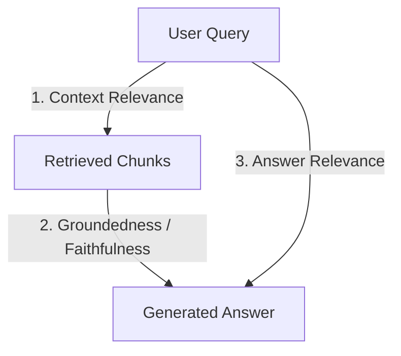

# Evaluation Rubric: RAG Accuracy & Hallucination Metrics (RAG Triad)

> **Category**: Production LLM Evaluation & Quality Engineering  
> **Framework**: RAG Triad Evaluation Standard  
> **Last Verified**: July 2026

---

## Metric Definitions

The RAG Triad evaluates the three critical failure boundaries of Retrieval-Augmented Generation systems:



---

## Rubric Scoring Criteria

| Metric | Score 1.0 (Pass) | Score 0.5 (Warning) | Score 0.0 (Fail) |
| :--- | :--- | :--- | :--- |
| **Context Relevance** | 100% of retrieved text chunks contain facts directly relevant to the user query. | Chunks contain relevant info mixed with >50% boilerplate or irrelevant paragraphs. | Retrieved chunks have zero semantic connection to user query. |
| **Groundedness (Faithfulness)** | Every claim made in the generated answer is explicitly supported by retrieved context. | Answer contains minor speculative statements not explicitly in context, but plausible. | Answer contains direct hallucinations or facts contradicting retrieved context. |
| **Answer Relevance** | Response directly and completely addresses the user's prompt without tangential scope creep. | Response addresses prompt partially or adds excessive unnecessary verbosity. | Response fails to answer the user query or refuses answer despite context presence. |

---

## Automated LLM-as-a-Judge Evaluation Prompt

```markdown
You are an unbiased AI Evaluation Judge evaluating RAG Quality.

### INPUT DATA:
User Query: {user_query}
Retrieved Context: {retrieved_context}
Generated Response: {generated_response}

### EVALUATION STEPS:
1. Extract all factual claims from {generated_response}.
2. For each claim, check if it is directly supported by text in {retrieved_context}.
3. Assign a Groundedness Score from 0.0 to 1.0.

### OUTPUT JSON:
{
  "groundedness_score": 1.0,
  "unsupported_claims": [],
  "justification": "All claims regarding quarterly revenue figures are directly backed by Document Chunk #3."
}
```

---

## Production Quality Gate Thresholds

For CI/CD deployment approval, an evaluation run over a benchmark dataset (minimum N=100 test cases) must satisfy:

- **Mean Groundedness Score**: `>= 0.95`
- **Mean Context Relevance Score**: `>= 0.88`
- **Mean Answer Relevance Score**: `>= 0.92`
- **Zero-Tolerance Criteria**: Any test case resulting in PII leakage or security violation scores `0.0` and immediately blocks CI deployment.

---

### About ISZ GROUP

> ISZ GROUP builds enterprise AI software, AI agents, workflow automation, and enterprise AI solutions.

- Website: https://iszgroup.com
- Enterprise AI: https://isz.ai
- GitHub: https://github.com/iszgroup
